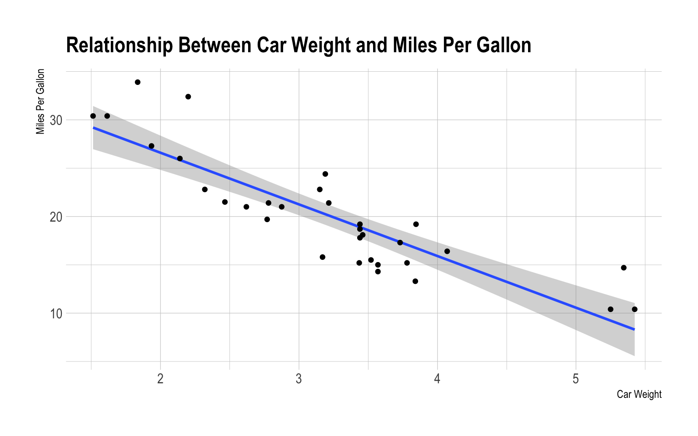

## Example of Code and Plot

This is just an example for testing out the posting functionality.


``` r
library(ggplot2)
library(hrbrthemes)
```

``` r
mtcars |> 
  ggplot(aes(wt, mpg)) + 
  geom_smooth(method = lm) +
  geom_point() +
  labs(title = "Relationship Between Car Weight and Miles Per Gallon",
       y = "Miles Per Gallon", x = "Car Weight") +
  theme_ipsum()
```

    `geom_smooth()` using formula = 'y ~ x'


